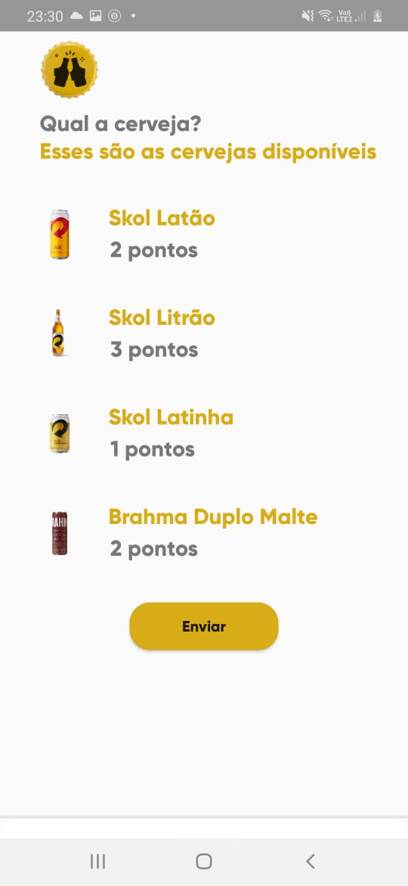
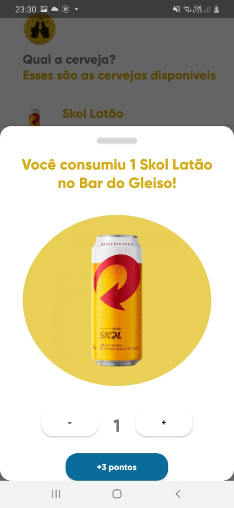
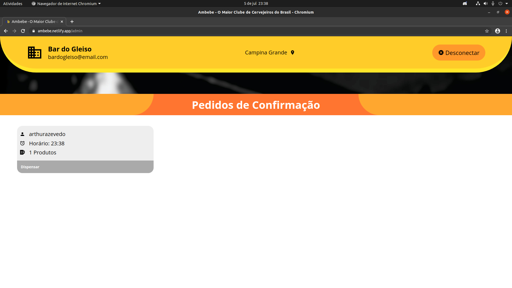
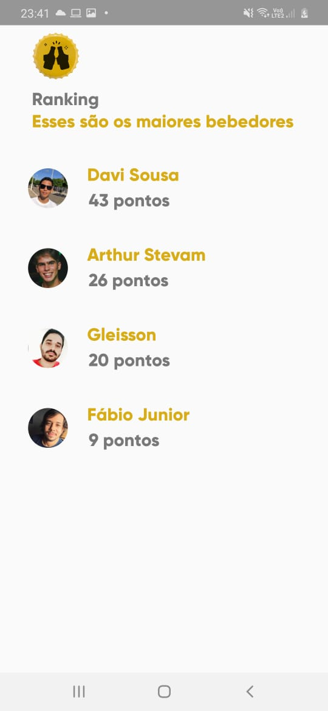

  

<h3 align="center">Ambebe</h3>
----

 Mega Hack 3.0
      
    Credenciais do bar rota <a href="https://ambebe.netlify.app/login">Login</a> 
    email: bardogleiso@email.com  
    senha: 153426

## 📝 Sumário

- [Problema](#problem_statement)
- [Solução](#idea)
- [Como utilizar](#usage)
- [Tecnologias utilizadas](#tech_stack)
- [Desenvolvedores](#authors)

## 🧐 Problema  

Este repositório foi criado com a intenção de resolver um problema proposto pela <b>Ambev</b> no <b>Mega Hack 3.0</b>. 

A proposta era solucionar a queda na presença dos consumidores em bares e restaurantes, afim de atrair mais consumidores e proporcionar uma melhor experiência nesses locais. 

## 💡 Solução 

Com o aplicativo <b>Ambebe</b>, buscamos tornar a experiência de frequentar bares e consumir seus produtos em algo mais divertido e recompensador. Para isso disponibilizamos de pontuações por consumo e recompensas resgatadas com tais pontos, além de um Rank por cidade de quem consegue juntar mais pontos.

## 🎈 Como utilizar 

<h3>Primeiro Passo:</h3> 

    Faça checkin em algum bar utilizando um QrCode. Para testes disponibiliamos o seguinte:

<h3>Segundo Passo:</h3>

    Disponibiliaremos uma lista de produtos <b>Ambev</b> para que o usuário selecione quais e quantas consumiu.

<h3>Terceiro Passo:</h3>

    Envie o seu consumo e peça para que o caixa do bar confirme na plataforma disponibilizada para bares e assim seus pontos sejam creditados.

<h3>Quarto Passo:</h3>
<h4>BUSQUE SEU LUGAR AO PÓDIO!</h4>

## ⛏️ Tecnologias

<ul>
<li>TypeScript </li>
<li>Node Js</li>
<li>Android Nativo</li>
<li>React</li>
<li>Socket.io</li>
<li>Postgres SQL</li>
</ul>

## ✍️ Desenvolvedores 

 
<b>Arthur Stevam</b>
 

 
<b>Davi Gomes</b>
 

 
<b>Fabio Júnior</b>
 

 
<b>Gleisson Michael</b>
 

 
<b>Matheus Gonzaga</b>
 

